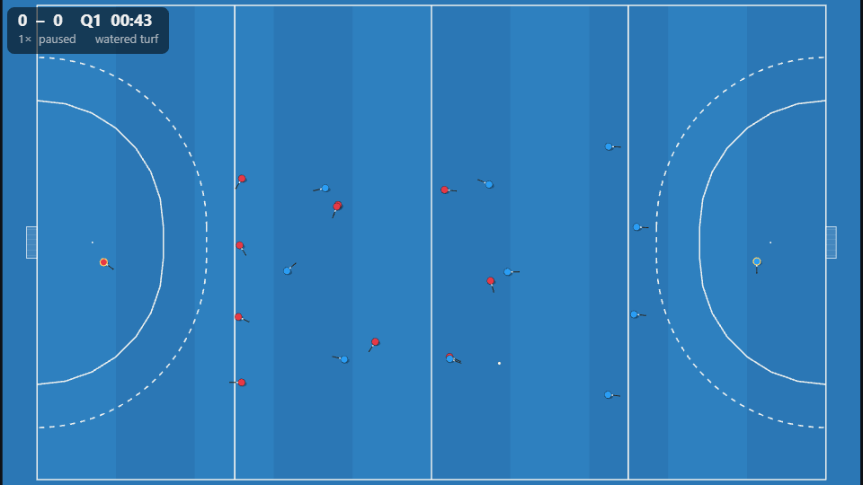
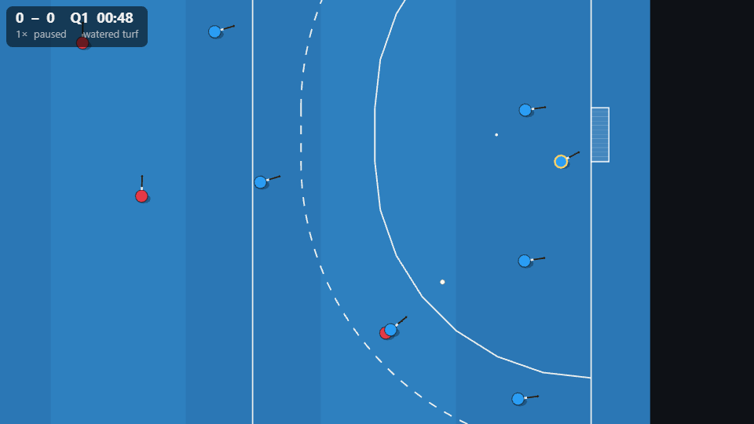

# Handoff — Phase 5: Renderer

**Date:** 2026-08-19
**Gate (BRIEF §8):** any saved event log replays frame-accurately, scrubs both ways, 1×–8×, 60 fps on a mid-range phone; no visible 20 Hz stepping; a goal *feels* like a goal; situational review with the coach panel.
**Status: core built and verified in three real browsers; the device-performance and "feels like a goal" halves of the gate need a human and a phone.** Automated: a Playwright-driven browser test mounts `MatchView` in Chromium, Firefox and WebKit, renders frames, and asserts frame-accurate seeking (same tick → identical pixels; different ticks → different pictures) and HUD state from events. Screenshots below.

## What was built

- **Replay storage format (open question #7 → decided):** `engine/src/replay/codec.ts` — `ReplayFile` v1 = header + events (verbatim, append-only) + quantised keyframes every 4 ticks (5 Hz; cm / mrad / ‰). Round-trip tested; a full match ≈ 16 MB JSON before gzip (≈ 3 MB gzipped) vs ~250 MB for full-tick float frames. Decoded logs have sparse frames; every consumer interpolates by tick.
- **`packages/render`**
  - `interp.ts` — interpolation buffer for frames of any cadence: positions lerp, angles shortest-arc, ball z parabolic between airborne keyframes; binary-searched. Tested.
  - `camera.ts` — director camera as pure math: circle/23 m-aware zoom, velocity lead, pitch clamping, critically-damped spring, zoom punch. Tested (no overshoot, tighter in the D).
  - `MatchView.ts` — Pixi 8 application: world in **metres** (geometry from `@bullyoff/shared`), procedural pitch (turf + mown stripes, wet sheen, boundary/centre/23 m lines, D straights + post-centred arcs, dotted 5 m circle, spots, goals with net hatch, dugouts; **line width re-drawn per zoom bucket** so lines stay ≥ 1.5 px on a phone), placeholder capsule players (tinted per team, keeper ring, heading nose, rotating stick, shadow, stamina-dimmed), ball with height-lifted sprite and offset shadow, HUD (score, quarter, playing clock reconstructed from events so scrubbing is exact), banners, playback (play/pause/speed 0.25–8×/seek/mode), **moments** (goal → slow-motion hold + banner + zoom punch + crowd/whistle; PC/PS banners; final whistle), auto-pause option, `renderFrame()` for synchronous draws, size sync per frame (no ResizeObserver — it fed back into layout and wedged the page).
  - `audio.ts` — WebAudio synthesised placeholders (dry crack vs wet slap by surface and speed, pea-whistle, crowd swell); silent until enabled; API stable for real SFX.
  - `browser/matchview.browser.test.ts` + `vitest.browser.config.ts` — the three-browser test; `pnpm test:browsers` now runs engine determinism **and** the render test.
- **`apps/manager`** — `engine/client.ts` (typed worker client), `stores/match.ts` (log + source; simulate/scenario/load/export), `MatchViewer.vue` (canvas + controls: play/pause, 1/2/4/8×, scrub, director/tactical, sound), `App.vue` (simulate a match — profile/turf/seed —, run a §6.2 scenario, load/export `.replay.json`, event ticker). The engine runs in the Web Worker (`simulateAi` and `scenario` messages added to the protocol/host).
- Vite launch config `.claude/launch.json` (`pnpm --filter @bullyoff/manager exec vite --port 5199`).

## What was decided

- **Metres everywhere in the world container; the camera is the only place scale enters.** Screen-space only for HUD/banners.
- **Frame-accurate = deterministic draw at a tick.** `renderFrame()` + `seek()` are the test hooks; the browser test asserts it.
- **Keyframes at 5 Hz for storage; live play uses full-tick frames from the worker.** The interpolator hides the difference.
- **Placeholders are honest placeholders.** Capsules, synth SFX. The Blender pipeline (ADR-012, open question #5) drops sprite sheets into the same layered composition (body/stick/shadow separate already).
- **No ResizeObserver** around the Pixi canvas — a resize→layout feedback loop froze the page during development; a per-frame size check is enough.

## What surprised us

- The hidden-tab dev flow (browser pane not composited) stalls rAF, `img.decode()`, and HMR remounts; the reliable verification was the Vitest browser test with a real viewport and `page.screenshot`. Keep that as the visual smoke test.
- The interpolator's parabolic z from endpoints alone gives believable flicks at 5 Hz keyframes without storing velocities.
- Even the placeholder director camera makes the D read as the important place — the zoom-tighten in the circle does most of the "storytelling" the brief asks for.

## What Phase 6 should watch out for (and what Phase 5 still owes)

Owed to close Phase 5's gate:
1. **A phone.** Measure fps on a mid-range Android at 1×–8× (Pixi resolution is capped at 2; consider capping at 1.5 on mobile and disabling antialias when the frame budget is missed).
2. **The coach panel** on the scenario deck (App → Run scenario) — record verdicts in `docs/rules/situational-review.md`.
3. **Real assets:** sprite sheets (Blender, ADR-012), recorded SFX, a display face for the wordmark. The layered composition and audio API are ready.
4. Moments to finish: shoot-out treatment (Phase 6 introduces shoot-outs), final-whistle sequence with the season context, PC tempo change (currently a banner + camera tighten).

For Phase 6 (manager shell):
5. `MatchLog` in, `ReplayFile` for storage (ADR-007: IndexedDB `replays` store, gzip on export). Season objects hold `ReplayFile`s or just `MatchStats` for unwatched fixtures — decide early; `matchStats(log)` is cheap.
6. Batch simulation of unwatched fixtures should reuse the worker `simulateAi` path with `frameEvery: 0` (no frames) — ~1.3 s per match on the main-thread worker; shard across two workers if a match day is slow.
7. Play-offs first (BRIEF): round-robin + bracket generation are two data shapes; build both before any table UI.
