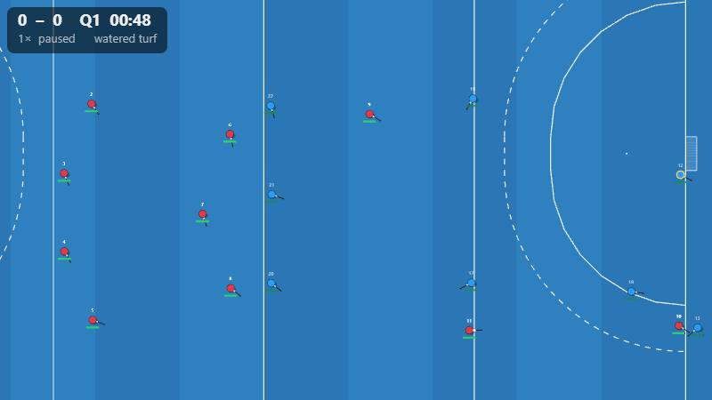

# Handoff — Phase 7: In-match coaching

**Date:** 2026-08-19
**Gate (BRIEF §8):** a coach can change a match's course from the bench with legal instructions only; the result stays deterministic for the same instructions; the substitution/PC tooling reads like the touchline of a Belgian club match.
**Status: the deterministic-instructions half is met by test; "reads like a Belgian touchline" is a coach judgement — owed with the Phase 3/5/6 reviews.** `packages/engine/src/ai/coach.test.ts` (5 tests) shows: a substitution instruction becomes a legal `Substitution` event with the named players; the same instructions reproduce the same log hash; a tactics instruction changes the match; the step-wise worker host with instructions is bit-identical to the one-shot `simulateMatch`; quarter stats sum to match stats. `packages/season` records a coached match exactly like a simulated one. The live/coach renderer path passes in Chromium, Firefox and WebKit.

## What was built

- **Engine**
  - `PlayerView.stamina` (rules types; the rules ignore it) — controllers see fatigue at last (open question #15 closed). Bench players recover 1.5× faster than idling on the pitch (`player.ts`).
  - **Stamina-driven rotation** in the utility AI (`brain.ts → substitutions`): the most tired outfield player below `tactics.rotateBelowStamina` (default now **0.7**) goes off when a clearly fresher same-role (else any) bench player exists. The old minutes-played proxy is gone. ≈ 4–8 rolling subs per team per match at default — still below a real Belgian top-division game (dozens) because the stamina model drains gently; see owed list.
  - **`CoachInstruction`** (`brain.ts`): tick-stamped, serialisable — `tactics` (patch any `TeamTactics` knob incl. `pcVariant`, `pcBattery`, `rotateBelowStamina`), `substitute`, `swapSlots`. `createAi(seed, squads, opts) → { controller, instruct, tactics, slotOf }`; `aiController` is unchanged sugar over it. Instructions are the **only** way a coach influences a match: no engine side channel; the engine still only sees `Command`s, all of which the AI emits under the laws (`gateCommand` still guards them).
  - **PC designer hooks**: `TeamTactics.pcBattery { injector?, trapper?, striker? }` — honoured at the moment of the award if those players are on the pitch; otherwise the AI picks as before (so goldens are unchanged when unset).
  - **Step-wise coached worker mode** (`protocol.ts`, `host.ts`): `initAi {setup, seed, tactics}` → `advance {ticks}` (the host runs the AI each tick and merges raw `commands`) → `instruct {instructions}` → `end`. Proven bit-identical to `simulateMatch` in the test.
  - **`quarterStats(log)`** (`stats.ts`): per-quarter goals, shots, circle entries, PCs, touches → possession share, tackles, cards — the briefing numbers.
  - **Rules fix found on the way**: a PC stayed active when the ball crossed the goal line without a goal (circle rule) — the battery then waited forever at the long corner and the match stalled to `maxTicks` (seed 4 at level 12). `endPc(..., 'out')` now runs in that branch; regression test in `rules.test.ts`. `ENGINE_VERSION` 0.4.0 → **0.5.0**; sandbox golden `51e34b89dcb71850`; scenario goldens regenerated (identical play, version in header).
- **Season**: `fixtureSetup(w, f)` (the exact engine setup + id map + tactics for a fixture), `recordFixture` (split out of `playFixture`), `recordCoachedFixture(w, fixtureId, log)` (stats, goals, minutes, injuries, replay, knock-out settlement) — test: coach a fixture with instructions, record it, `advanceDay` plays the rest.
- **Renderer**: `ViewMode` gains **`coach`** (whole pitch + shirt numbers + stamina bars, the coach's team bright); `MatchViewOptions.live` + `append(events, frames)` + `lag` for a log that grows; reaching the newest frame in live mode waits for data instead of stopping. Browser test covers it in all three engines.
- **Manager app**: `EngineClient.initAi/advance/instruct/end`; season store `todaysUserFixture`, `startCoaching()` (builds the `Coaching` bundle from the world), `finishCoaching(log)` (season worker `record` message), `abandonCoaching()`; **`CoachView.vue`** — the touchline: live canvas (director / tactical / coach), play/pause, 1–4×, **quarter briefings** (auto-pause on `QuarterEnd` with the quarter's numbers and the tired list), **tactics panel** (press height, defensive line, tempo, build-up, rotate-below), **PC designer** (variant + injector/trapper/striker from the on-pitch outfield), **rotation bar** (on-pitch with live stamina bars, bench, click out + in → substitute; swap positions), a ticker of what happened, "sim to full time", "leave (not recorded)". SeasonView shows **Coach today's match** when the user's fixture is on today's card; the match day button then says "Sim match day (incl. mine)". Store posts `toRaw(world)`; logs are `markRaw` (a reactive proxy over 100k frames is unusable).

## What was decided

- **Instructions are data, stamped by the engine's clock, applied by the AI.** The coach sees the play head; the worker runs ≤ 2.5 s (50 ticks) ahead so the touchline stays responsive without the UI ever simulating. An instruction lands "in a moment" — honest, and the replay is reproducible: setup + seed + instruction list.
- **Rotation is stamina-driven now and it changed the AI's logs** — the version bump and golden regeneration were deliberate. Calibration re-run recorded below.
- **Auto-pause defaults** (open question #22): quarter breaks only, in the coach view; goals/PCs are moments, not stops.
- **No new engine commands.** Everything the coach does still becomes `move/strike/substitute/...` through the AI — the arcade front-end (v1.x) can reuse `CoachInstruction` for its bench.

## What surprised us

- A match could stall forever (the PC ruling above) and nothing in four phases of tests had hit it — the quarter-briefing test did, by accident, on seed 4. Long-horizon structure tests (Phase 6) use the quick resolver, so they never saw it either. Lesson: keep at least one full-match-per-seed sweep in CI with a hard `maxTicks` assertion (now implicit: `quarterStats` would return one quarter).
- Default `rotateBelowStamina` 0.45 produced ≈ 2 subs per match; real amateur hockey rotates constantly. 0.7 is a compromise until the stamina curve is tuned (owed).
- Vitest 3's worker RPC heartbeat starves under ~50 s of synchronous simulation (seen in Phase 6's season test) — yield between match days.

## What Phase 8 should watch out for (and what Phase 7 still owes)

Owed to close Phase 7:
1. **Touchline review by a coach** — play a match from the bench (`pnpm dev:manager` → Season → Coach today's match): is the PC designer what a Belgian club coach would expect? Which tactics knobs are missing (press triggers, outlet side, man-marking the drag-flicker)?
2. **Stamina curve** — drains too gently for realistic rotation volume; tune `staminaDrainAtMax` / `staminaRecoverIdle` per profile and re-calibrate (subs per match as a new calibration row).
3. **Instruction record in the replay** — `ReplayFile` v2 could carry the instruction list (and tactics at kick-off) so a coached replay is self-describing; today the season fixture has the log only.
4. **Phone check** of the coach view — the overlay labels are world-space text (scale 0.045) and re-render per zoom; verify legibility at 1280×720 and 390×844.

For Phase 8 (world generation):
5. `createWorld` in `packages/season/src/world.ts` is the placeholder to replace: name pools, real-club blocklist (C3), colours/badges, club histories, 20 seasons of generated past (`history` rows exist; generate them backwards with the quick resolver, labelled).
6. The coach view needs club colours (`MatchViewOptions.homeColour/awayColour` are there; `Club.colours` exists) — wire them when worldgen makes them meaningful.
7. Keep `fixtureSetup` as the single source of the engine setup for a fixture; worldgen must not grow a second one.
